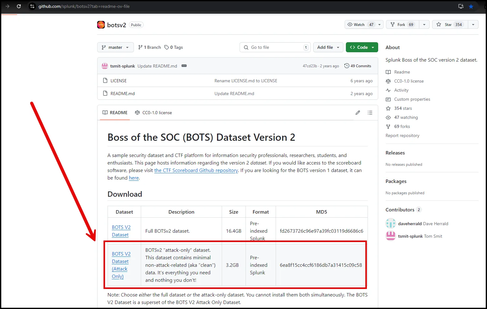
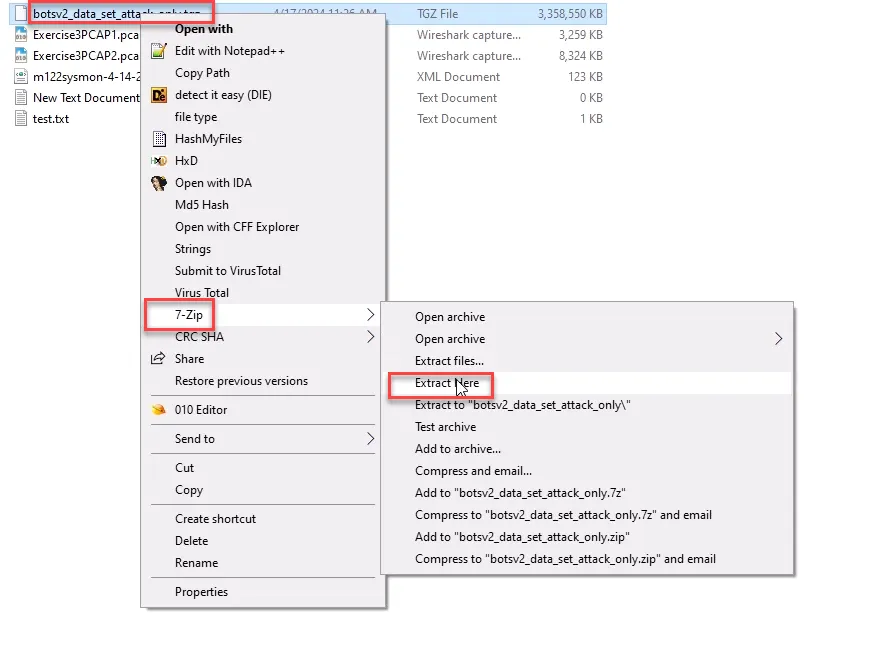
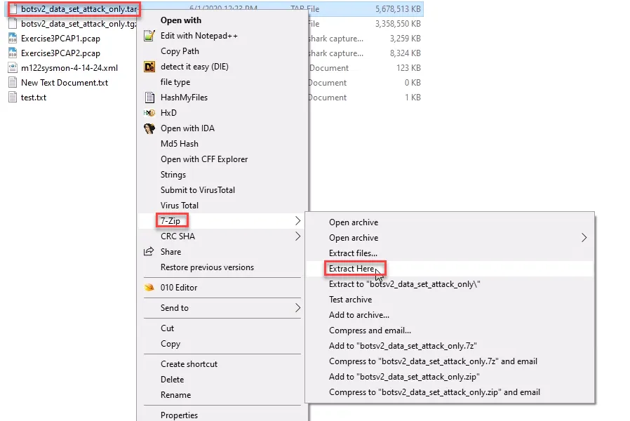
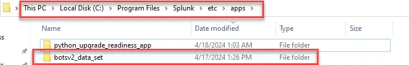

# Threat Hunting with Splunk Setup

Using the Windows VM 1 from our virtual lab environment, download the botsv2 dataset from the link below.

[GitHub - splunk/botsv2: Splunk Boss of the SOC version 2 dataset.](https://github.com/splunk/botsv2?tab=readme-ov-file)

Select the Attack Only dataset.



## Ingest botsv2 Dataset

Once it is downloaded, use 7-zip on the downloaded dataset file twice. Once to decompress it and once to unarchive it. 

<aside>
💡



</aside>

<aside>
💡



</aside>

Move the unarchived folder botsv2_data_set to the following path on your Windows VM: C:\Program Files\Splunk\etc\apps

<aside>
💡



</aside>

Ensure the data was ingested by going to the Search and Reporting app and setting the time picker to a range between 1 August 2017- 31 August 2017. Use the query below:

```powershell
index=botsv2 sourcetype=stream:smtp
```

If you have multiple hits to your query, as seen below, the data ingestion was successful.