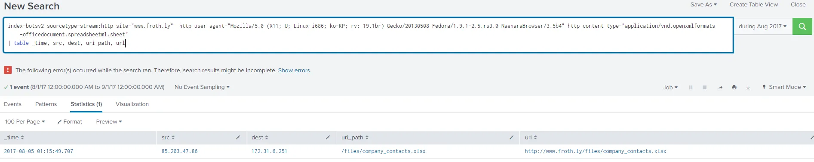

# Cyber Threat Hunting with Splunk: Part 1: Reconnaissance

## Summary:

In this lesson we will introduce the concept of cyber threat hunting using Splunk. We will use the Splunk Boss of the SOC (BOTS) version 2 dataset that we ingested in the setup. The Splunk Boss of the SOC (BOTS) dataset is a tool that provides a simulated enterprise network environment with machine data from a variety of sources. 

## Objectives:

The objective of today’s session is to introduce you to threat hunting with Splunk

Objective 1: Continued practical familiarization using Splunk.

Objective 2: Analyze recon techniques by an emulated APT campaign data set.

Objective 3: Create hunt hypotheses and plans based on threat intelligence reports.  

Objective 4: Identify indicators of compromise. 

## References:

[Splunk Boss of the SOC](https://bots.splunk.com/workshop/6RJewJH2JCQ5jIQLiHVUSA)

## Cyber Threat Hunting Review

Cyber threat hunting is a proactive approach to cybersecurity aimed at detecting and mitigating advanced threats that may evade traditional security measures. It involves actively searching for signs of malicious activity or security breaches within an organization's network infrastructure, systems, and endpoints.

Unlike traditional cybersecurity measures, which rely heavily on automated tools and predefined signatures to identify known threats, threat hunting involves human analysts using a combination of tools, techniques, and expertise to actively seek out indicators of compromise (IOCs) or suspicious behavior that may indicate the presence of unknown or sophisticated threats.

## Scenario

Law enforcement warned your organization about a current campaign that may have impacted your organization. This campaign has been active against other organizations from the same industry sector. Based on the information below you must develop a Hunt hypothesis, plan of action, and execute the plan.

**Threat Intel Report Excerpt**

“The unknown adversary is conducting reconnaissance of public-facing webservers using a non-standard browser over port 80.” 

**What Source Types are Available**

We will be using Splunk to conduct most of our investigation. One of the key points to know when developing a Hunt plan is what information is available to conduct the hunt. For example, we know this hunt involves looking for recon activity from a non-standard browser against our public-facing websites. What source types would be beneficial in our hunt? A useful query to see what source types are available in our Splunk instance (index=botsv2) is shown below.

```jsx
| metadata type=sourcetypes index=botsv2
```

<aside>
💡 As seen below, the sourcetype “stream:http” jumps out as being potentially useful in this hunt.


</aside>

**Hypothesis**

Based on threat intelligence we assume that the malicious actor has targeted our organization in August 2017, by conducting recon against our websites.

**Plan of Action**   

We will begin by reviewing the web logs (sourcetype: stream:http) during the month of August in search for non-standard browsers. We can do this by looking at the user agent strings. Based on our findings we will pivot to the originating IP address.  

User agent strings are pieces of text that web browsers and other web clients send to servers to identify themselves. They typically include information such as:

1. **Browser Name and Version:** (e.g., Chrome, Firefox, Safari, etc.)
2. **Operating System:** (e.g., Windows, macOS, Linux, Android, iOS)
3. **Device Type:** (e.g., desktop, mobile, tablet)
4. **Rendering Engine:** (e.g., WebKit, Gecko, Blink)
5. **Additional Details:** Sometimes includes information about plugins, extensions, or specific browser configurations.

For example, a typical user agent string might look like this:

Mozilla/5.0 (Windows NT 10.0; Win64; x64) AppleWebKit/537.36 (KHTML, like Gecko) Chrome/91.0.4472.124 Safari/537.36

```go
Mozilla/5.0 (Windows NT 10.0; Win64; x64) AppleWebKit/537.36 (KHTML, like Gecko) Chrome/91.0.4472.124 Safari/537.36
```

- **Mozilla/5.0**: Indicates compatibility with Mozilla (though the browser might not actually be related to Mozilla Firefox).
- **Windows NT 10.0; Win64; x64**: Specifies the operating system (Windows 10 64-bit).
- **AppleWebKit/537.36**: The rendering engine (in this case, WebKit).
- **Chrome/91.0.4472.124**: Browser and version (Chrome version 91.0.4472.124).
- **Safari/537.36**: Additional information and compatibility.

Websites use user agent strings to tailor content and functionality to the capabilities and constraints of the requesting client device.

**Initial query**

We will use the time frame of August 2017 for our hunt. Set the time picker accordingly.

<aside>
💡


</aside>

Our first query will be using the sourcetype stream:http to see what fields are available

```powershell
index=botsv2 sourcetype=stream:http
```

<aside>
💡 As seen below, there are fields for user agent strings (“http_user_agent”) and website (”site”) that we can use to determine which user agents accessed our organization website, froth.ly.


</aside>

We can now write a query that will show us all user agent strings that accessed our website [froth.ly](http://forth.ly) and the number of times it was seen.

```go
index=botsv2 sourcetype=stream:http site="[www.froth.ly](http://www.froth.ly/)"
| stats count by http_user_agent
| sort + count
```

1. **Below is an explanation of the query:**
2. **Index and Sourcetype Selection**:
    - `index=botsv2 sourcetype=stream:http site=www.froth.ly`: This filters data from the `botsv2` index where the sourcetype is `stream:http` and the `site` field is `www.froth.ly`.
3. **Statistics Calculation**:
    - `| stats count by http_user_agent`: This calculates statistics on the data retrieved. Specifically, it counts the occurrences of each unique `http_user_agent` value.
4. **Sorting**:
    - `| sort + count`: This sorts the results in ascending order based on the `count` field, which is the number of occurrences of each `http_user_agent`.

The reason we sorted by ascending order is because of the Least Frequence of Occurance (LFO). Least frequency of occurrence (LFO) is **a method that counts the number of times each unique value appears and sorts them in ascending order.** The values with the lowest counts are considered outliers. LFO is also known as stack counting. LFO is useful when separating potential maliciousness from large amounts of data.
 

This query is used to analyze and understand the distribution of user agents accessing the `www.froth.ly` site. It helps in identifying which clients (browsers, bots, scripts, etc.) are accessing the site and how frequently. As seen below one user agent stands out as having a nonstandard browser, NaenarBrowser.


Using an open source website, linked below, we can learn more about the user agent string. 

[](https://explore.whatismybrowser.com/useragents/parse/)


As seen above, the Naenara browser is being run from a Fedora Linux system. The Linux system is not uncommon; however, we should do more research on the browser. By using Google we discovered that Naenara is a North Korean web browser.


While this is informative we should not jump to conclusions when it comes to attribution. We can now pivot from the user agent string to discover more, such as source IP address. 

We can pivot by clicking the user agent string and selecting view events. This adds the user agent string to our query. 

```go
index=botsv2 sourcetype=stream:http site="www.froth.ly"  http_user_agent="Mozilla/5.0 (X11; U; Linux i686; ko-KP; rv: 19.1br) Gecko/20130508 Fedora/1.9.1-2.5.rs3.0 NaenaraBrowser/3.5b4"
```


Now we can add a stats count by the source destination ip address to determine the IP address the session with the Naenar browser connected to our website.

```go
index=botsv2 sourcetype=stream:http site="[www.froth.ly](http://www.froth.ly/)"  http_user_agent="Mozilla/5.0 (X11; U; Linux i686; ko-KP; rv: 19.1br) Gecko/20130508 Fedora/1.9.1-2.5.rs3.0 NaenaraBrowser/3.5b4"
| stats count by src dest
```

As seen below, all the sessions were from a single IP address, 85.203.47.86.


 Now we know the IP address (85.203.47.86) that the user agent used to connect to www.froth.ly. 

We can then research the IP address using open source intelligence. Using IPinfo.io, with a free account, we can research the IP address 85.203.47.86.

[Trusted IP Data Provider, from IPv6 to IPv4 - IPinfo.io](https://ipinfo.io/)

As seen below, we can see that 85.203.47.86 is part of the ExpressVPN service.


If you are not familiar with ExpressVPN, it is a widely trusted VPN service that offers strong security features, global server coverage, and ease of use, catering to both privacy-conscious individuals and those needing to bypass geographical restrictions on content. It basically provides users, including malicious users, the ability to appear to originate from nearly any country in the world. Obviously, this adds complications to making an accurate attribution.

## Continue Hunting

 At this point we know that a suspicious user agent accessed our public-facing website. We need to continue our analysis to determine what information was accessed. This may give us insight in to the intent of the attacker. 

By running our previous query, we can look at other available fields and what kind of information we can discover.

```go
index=botsv2 sourcetype=stream:http site="[www.froth.ly](http://www.froth.ly/)"  http_user_agent="Mozilla/5.0 (X11; U; Linux i686; ko-KP; rv: 19.1br) Gecko/20130508 Fedora/1.9.1-2.5.rs3.0 NaenaraBrowser/3.5b4"
| stats count by src dest
```

As seen below, there is a field named http_content_type. That field includes the type of information that was accessed. The most interesting type of information access is a spreadsheet.


By adding the interesting content type to our search and reviewing the uri_path field, we can see the name of the spreadsheet is company_contacts.xlsx.


Creating a table the information is presented in a more useful format.

```go
index=botsv2 sourcetype=stream:http site="[www.froth.ly](http://www.froth.ly/)"  http_user_agent="Mozilla/5.0 (X11; U; Linux i686; ko-KP; rv: 19.1br) Gecko/20130508 Fedora/1.9.1-2.5.rs3.0 NaenaraBrowser/3.5b4" http_content_type="application/vnd.openxmlformats-officedocument.spreadsheetml.sheet"
| table _time, src, dest, uri_path, url
```



A spreadsheet with company contacts is the kind of information an adversary would search for during a reconnaissaince. This could provide them with a target list for social engineering/phishing. 

Below is a diagram of what we know.

 


A user using a suspicious user agent connected to our public-facing webserver using ExpressVPN and downloaded a file named company_contacts.xlsx.